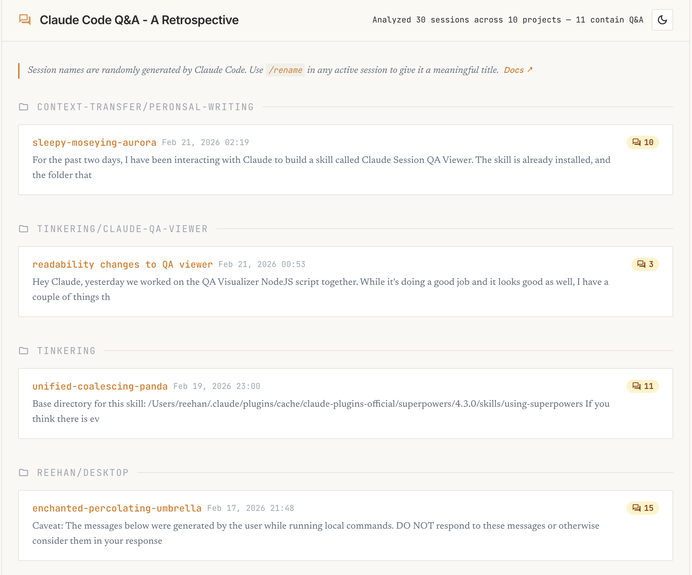
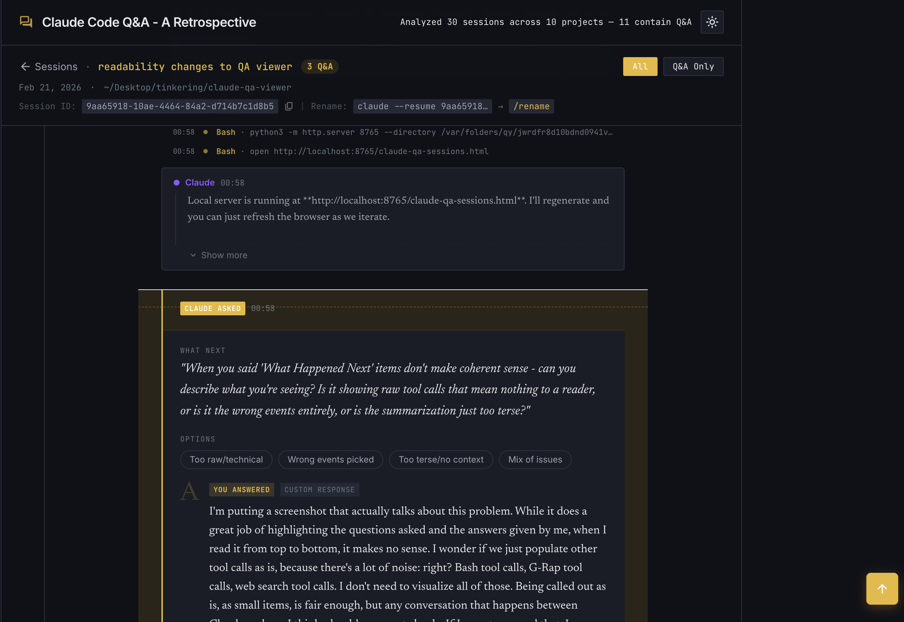

# Session Q&A viewer

A Claude Code skill that generates an interactive HTML visualization of your Q&A sessions.

All session transcripts across all projects are scanned, but only sessions that contain `AskUserQuestion` interactions are visualized. Sessions without Q&A are counted in the header stats but not listed.


## Install as a Claude Code skill

Clone directly into your skills directory:

```bash
git clone https://github.com/R-eehan/claude-qa-viewer.git ~/.claude/skills/session-qa-viewer
```

Then from any Claude Code session, in any directory:

```
/session-qa-viewer
```

## Run directly (no skill)

```bash
git clone https://github.com/R-eehan/claude-qa-viewer.git
node claude-qa-viewer/scripts/visualize-qa.js
```

## Where can I run this?

Anywhere. The skill reads from `~/.claude/projects/` which is a global location, so it works from any project directory.

This only works with Claude Code sessions. Conversations from the Claude web app (claude.ai) or the Claude desktop app are stored server-side and not available locally.

## Session names

Session names displayed in the viewer are randomly generated by Claude Code. Use `/rename <name>` in any active session to give it a meaningful title. The transcript view also shows the session ID so you can resume and rename past sessions. See the [Claude Code docs](https://code.claude.com/docs/en/interactive-mode#built-in-commands) for more.

## What you'll see

- **Q&A cards**: every `AskUserQuestion` interaction, highlighted with the question, options, and your answer
- **Conversation entries**: Claude's messages and your messages shown as a readable back-and-forth, truncated with expand/scroll
- **Tool call pills**: compact single-line entries for Bash, Grep, WebSearch, etc.

### Session listing (light mode)



### Transcript view (dark mode)



## Scope

This reads all your Claude Code sessions across all projects by default. It scans every `.jsonl` transcript in `~/.claude/projects/`. There is no option to filter by project or session at this time.

## Features

- Multi-project aggregation across all Claude Code sessions
- 3-tier visual hierarchy: Q&A cards, conversation, tool pills
- Expandable and scrollable conversation entries
- Light and dark mode with system preference detection
- Q&A-only filter mode
- Copy Q&A pairs as JSON
- Copiable session ID with rename workflow hint
- Sticky navigation header with back-to-top button
- Zero external dependencies (Node.js built-in modules only)

## Requirements

- Node.js
- Claude Code with session history at `~/.claude/projects/`
